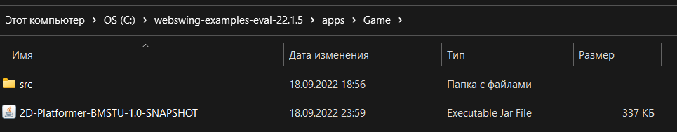
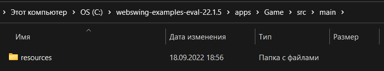

# ptp2022-10-2d-game
2D-игра (капитан Аркадий Шевыров)

# Game "Cave searches":
2D, side view.
Single player game.
GamePlay: The player jumps on platforms, collects coins, dodging enemies and traps.
The goal of the game is to collect all the coins on the level and enter the portal.

## Founders:
- Шевыров Аркадий: https://github.com/ArkadiyShevyrov
- Потребина Валерия: https://github.com/ValeryPotrebina
- Величко Егор: https://github.com/egorkacc
- Панкратов Артём: https://github.com/pank-art
- Слава Будников https://github.com/evmevmevmevm

## How to launch:
### How to launch in PC
1. Install maven and java.
2. Clone the repository.
3. Run build ```mvn package``` in main folder
4. Run ```java -cp target/2D-Platformer-BMSTU-1.0-SNAPSHOT.jar main/MainClass``` in main folder
### How to launch in WEB
1. Install maven and java.
2. Clone the repository.
3. Run build ```mvn package``` in main folder
4. Download the distribution from the Webswing home page and unzip it to a new folder. For demonstration we use ``C:\webswing``
5. Open a command prompt and make sure you are using the current Java executable (java 17). (Verify by running java -version)
6. Copy with replacement from the repository ``/webswing/webswing.config`` to ``C:\webswing``
7. In ``C:\webswing-examples-eval-22.1.5\apps`` created new Directory ``Game``
8. Copy from repository ``target\2D-Platformer-BMSTU-1.0-SNAPSHOT.jar`` in ``C:\webswing-examples-eval-22.1.5\apps\Game``
9. 
10. In ``C:\webswing-examples-eval-22.1.5\apps\Game`` created new Directory ``src\main``
11. Copy from repository ``\src\main\resources`` in ``C:\webswing-examples-eval-22.1.5\apps\Game\src\main\``
12. 
13. Double click on the ``C:\webswing-examples-eval-22.1.5\webswing.bat`` file to start the Webswing server.
14. in the browser, go to ``http://localhost:8080/game/``
15. "username" : "admin" 
16. "password" : "pwd"
17. Playing!

## Controls:
attack: ```LBM```  
left: ```A```  
right:```D```  
jump: ```SHIFT```  
